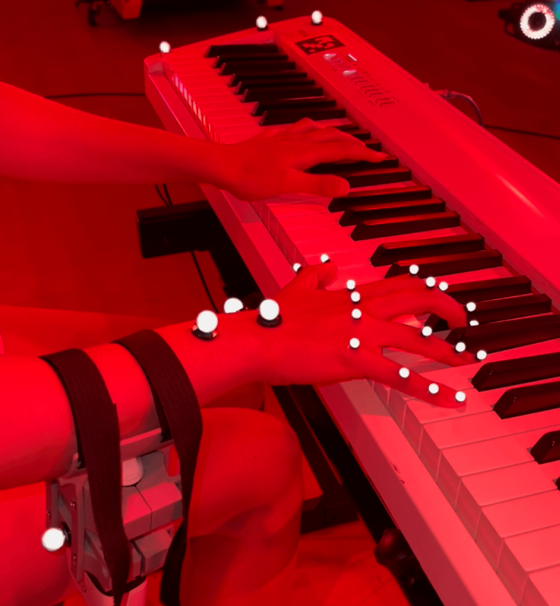
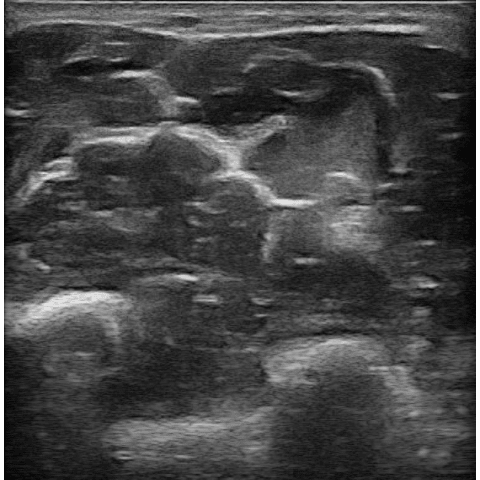
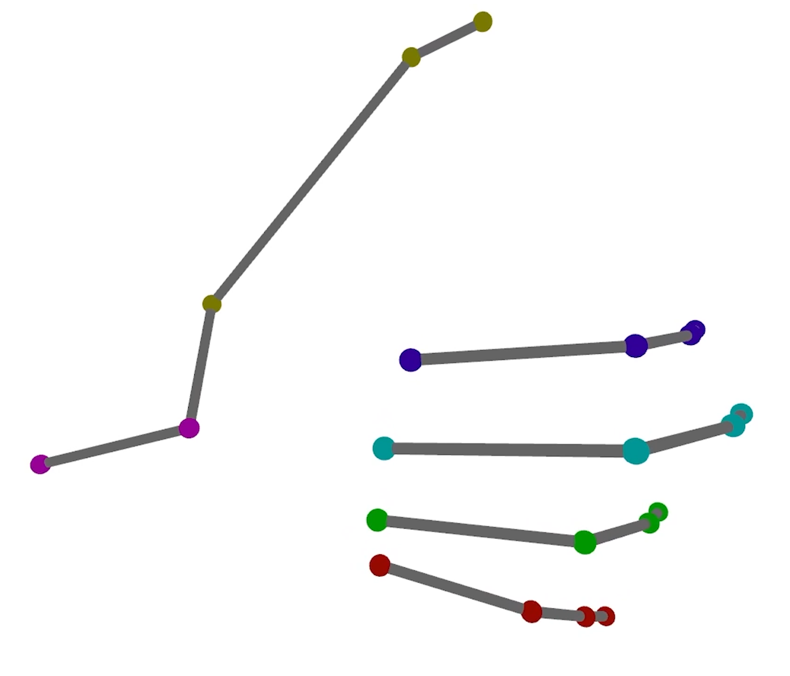

# Dataset  

Official dataset for [https://arxiv.org/abs/2202.05204](https://arxiv.org/abs/2202.05204).  

    
*Left to right: 1) The recording process demonstrated on one of the twelve subjects. Only the right hand is being recorded, as the motion capture, ultrasound, and piano devices are collecting data simultaneously. 2) An example of an ultrasound image taken from one of the recording sessions. 3) An illustration of a configuration of the hand using a hand skeleton formed by one of our simulations.*

## Download Link  

[https://cis.cs.technion.ac.il/finemotions/](https://cis.cs.technion.ac.il/finemotions/)

## Overview  

The dataset was collected from 12 subjects, averaging at 23 years old, seven of whom are men and five of whom are women. All subjects were confirmed to be right-handed, experienced in playing piano, and without any neurological disorders or deformity in the relevant hand area.  
  
At the beginning of both tasks, subjects were instructed to put their hands in a stationary state in which each of their fingers must be on the same note/key for the entire session. For piano playing, subjects were asked to play melodies that only require five distinguished notes and can be played using one hand only. For keyboard typing, subjects were asked to randomly type on each of the five keys their fingers are stationed over, while not using more than one key at the same time. For each task, subjects were asked to perform 2-3 sessions, with approximately ninety seconds for each session, and rest between sessions.  

**Piano Playing**  

* 25 recording sessions.  
* 44,596 samples.  

**Keyboard Typing**  

* 24 recording sessions.  
* 42,143 samples.  

## Data Collection Setup  

The data collection setup includes a [Clarius L15HD](https://store.clarius.com/products/l15-high-frequency-linear-scanner) (wireless B-mode US device), a [Roland FP-30](https://www.roland.com/us/products/fp-30/) (digital piano), a standard keyboard, and a [Vicon](https://www.vicon.com/) motion-capture system. The US’s configuration was set for the musculoskeletal task (MSK), with 10 MHz frequency generating a 5 cm × 5 cm processed image at a rate of 19-21 images per second, in a resolution of 480×480. It was attached using a wearable strap to the lower arm. The piano and keyboard were used to record the set of pressed notes and keys during each US frame and the Vicon system was used to track the palm’s joint locations.  

## Preprocessing  

* Ultrasound images are being stored as PIL images.  
* Motion capture frames are going through frame completion using interpolation, and joint angles are extracted by computing angles between vectors according to the paper appendix.  
* For both piano playing and keyboard typing, key pressing events are being turned into multi-hot vectors describing which of the fingers is currently pressing for each data sample.
* All data modalities were calibrated using manual calibrations that are transparent to the user, and the data is supplied after the calibration process.

## Structure

Each H5 file name is composed of the subject's ID (01 to 12), the type of the task (piano playing or keyboard typing), the number of the enrollment (in order to know if between two sessions that were recorded by the same subject, the probe was removed or not), and the number of the session itself. Each H5 file contains a Pandas DataFrame table of the data from the same recording session. The columns are the data features while the rows are the data samples ordered by recorded timestamp.  

The data contains the following columns:  

* datetime - The official timestamp of the sample.  
* img - An ultrasound image as a PIL image.  
* thumb<> or finger<> - The 3d position ([x,y,z]) of the joint in millimeters, measured w.r.t. a certain point in the recordings room. For information on which of the points relates to which of the joints, please refer to Fig. 9 in our paper.  
* probe<> - A set of 3d positions ([x,y,z]) of points taken from the probe itself. Useful for measuring the position of the probe w.r.t. the hand if needed.
* joint<> - The set of joint angles that are used in our paper (i.e., the intermediate representation). There are 17 joint angles - three for the wrist (jointwr, jointwp, and jointwy stand for Jwr, Jwp and Jwy respectively). Two joints for the thumb (jointt5 and jointt6 stand for J11 and J12 respectively). The other four fingers are denoted with the fingers enumerated from 1 to 4 instead of 2 to 5 as described in the paper (e.g., joint11 stands for J21 and joint43 stands for J53).  
* <>_der - For several joint angles and positions, we calculated the approximated derivation of the value, to be used as velocities (or accelerations with second derivation). The approximation was calculated using np.gradient on the entire sequence.  
* notes_multi - Exist in piano playing sessions, a vector of size 5 denoting which of the fingers is currently pressing its note for the current sample. If neither of the fingers currently pressing, the vector will include zeros only.
* keys_multi - Exist in keyboard typing sessions, a vector of size 5 denoting which of the fingers is currently pressing its key for the current sample. If neither of the fingers currently pressing, the vector will include zeros only.

Notice there might be other data columns in the dataframe that were not used in this paper.  

### Acknowledgments  

We thank the subjects that participated in the creation of this dataset, and their agreement to make the data publicly available for research.  