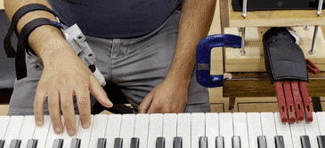

# Towards Predicting Fine Finger Motions from Ultrasound Images via Kinematic Representation  

Official code repository for [https://arxiv.org/abs/2202.05204](https://arxiv.org/abs/2202.05204).  

  

*A demo showing our system connected to a robotic hand, continuously replaying notes played on the piano in real time, given only the stream of ultrasound images taken from the lower limb.*

### System Requirements  

* Operating system - Windows 10 or Ubuntu 18.04.  
* GPU - Nvidia RTX2080Ti or higher is recommended (the research was done using RTX2080Ti).  
* RAM - 32GB or higher is recommended.  

### Installation  
  
The project is based on Python 3.8 and TensorFlow 2.4. All the necessary packages are in ```requirements.txt```. We recommend creating a virtual environment using Anaconda as follows:  
  
1) Download and install Anaconda Python from here:  
[https://www.anaconda.com/products/individual/](https://www.anaconda.com/products/individual/)  
  
2) Enter the following commands to create a virtual environment:  
```
conda create -n tf38 python=3.8 anaconda
conda activate tf38
pip install -r requirements.txt
```
  
For more information on how to manage conda environments, please refer to:  
[https://docs.conda.io/projects/conda/en/latest/user-guide/tasks/manage-environments.html](https://docs.conda.io/projects/conda/en/latest/user-guide/tasks/manage-environments.html)  
  
### Dataset  
  
We are currently working on receiving the acknowledgments to make our dataset public. It will be published soon here. Stay tuned!

  
### Overview  
  
Training and testing-related files are found in the trainer folder, where they are operated using configuration (JSON) files that are organized in the config directory. The data folder contains a data loader that is executed for both training and testing, and the evaluation folder contains all the necessary code to replicate the experiments presented in the paper (given outputs from the testing procedures).  

The models presented in the paper as the multi-frame (MF) and the configuration-based multi-frame (CBMF) models are both found in ```trainer/models/mf.py``` under the ```MultiFrameModel``` class, the model referred to as the single-frame (SF) model can be found in the same folder in ```deepnet.py```, and the two presented baselines are implemented in ```classic.py``` that is in the same folder and evaluated using ```trainer/test_classic.py```.  
  
We should note that the code also includes modules that were not used in this paper, such as more complicated robotic metrics and handling positional data of the arm.  
  
**Training**  

All training sessions are executed using the same training file (```trainer/train_forward.py```), by calling different JSON files. An example of training the MF model for piano playing on the dataset is as follows:  

```  
python trainer/train_forward.py --json config/mfm/train_mfm_unet_aida_all_us2multimidi.json  
```  

Training the CBMF model for the same task is done using pre-training for predicting hand configuration, followed by retraining the same model to predict both configurations and midi keys:  

```  
python trainer/train_forward.py --json train_mfm_unet_aida_all_us2conf_mp.json  
python trainer/train_forward.py --json train_mfm_unet_aida_all_us2conf2multimidi.json  
```  

These JSON files contain all the necessary properties and there is no need to feed the python script with additional arguments.  
  
**Testing**  
  
Testing typing (keyboard and piano) is available using ```test_pressing.py```, and testing configuration predictions is available using ```test_conf.py```. Executing each test session will load the trained weights and test the model for a selected fold out of 5 folds (defined in the JSON files). Both test scripts can be executed using the same JSON file. For example, the following execution lines will test the same model for configurations prediction and typing:  

```  
python trainer/test_conf.py --json test_mfm_aida_all_us2conf2multimidi.json  
python trainer/test_typing.py --json test_mfm_aida_all_us2conf2multimidi.json  
```  

Each will store its own metrics and raw data. The JSON files contain all the necessary information required to operate the test session. Be advised that each JSON file has MODE definition, representing the data structure for training/testing. For example, 'us2conf' and 'us2multikey' relates to tuples of (images, configurations) and tuples of (images, pressing vectors) respectively.

### Real-time Implementation  

We built a setup for online real-time inference to demonstrate piano playing on demand. The code is written in C++ and is found in the ```rtcode``` folder. The ```main.cpp``` file contains callbacks for managing all interfaces (ultrasound, model, and target interface) that are executed using multi-threading, as described in the appendix of our paper.
The code used to communicate with the ultrasound device is based on the [Clarius Cast API](https://github.com/clariusdev/cast/).
The ```ONNXModelManager``` class is in charge of loading the model and computing predictions, and the ```SerialCommManager``` is in charge of managing the communication with a serial comm port.  

In our setup, we used the open-sourced Haifa3D's Oded hand, a robotic hand designed to provide an affordable 3d-printed and programable prosthetic for arm amputees. The messages are sent through the serial port to an ESP module that manages the communication and instructs the robotic hand wirelessly (```rtcode/target_interface/esp_code.ino```). The following repositories are available to reproduce the hand and its interface:  
[Hand mechanical design](https://github.com/Haifa3D/hand-mechanical-design/)  
[Hand electronic design](https://github.com/Haifa3D/hand-electronic-design/)  

### Citing  
  
If this repository helped you in your research, please consider citing:  
```  
@article{DBLP:journals/corr/abs-2202-05204,
  author    = {D. Zadok and
               O. Salzman and
               A. Wolf and
               A. M. Bronstein},
  title     = {Towards Predicting Fine Finger Motions from Ultrasound Images via
               Kinematic Representation},
  journal   = {arXiv},
  volume    = {abs/2202.05204},
  year      = {2022}
}
```
  
### Acknowledgments  

This project has received funding from 
the European Research Council (ERC) under the European Union’s Horizon 2020 research and innovation programme (grant agreement No. 863839),
the Israeli Ministry of Science \& Technology grants No. 3-16079 and 3-17385,
and the United States-Israel Binational Science Foundation (BSF) grants no. 2019703 and 2021643.
We also thank the subjects that participated in the creation of the dataset, and [Haifa3D](https://www.facebook.com/Haifa3d/), a non-profit organization providing self-made 3d-printed solutions, for their consulting and support through the research.  