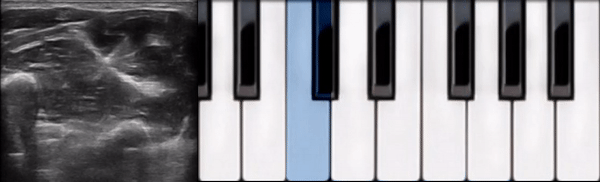
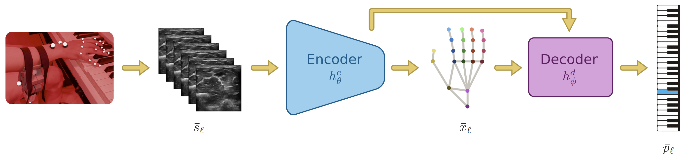

# Towards Predicting Fine Finger Motions from Ultrasound Images via Kinematic Representation  

Official code repository for [https://arxiv.org/abs/2202.05204](https://arxiv.org/abs/2202.05204).  

  

*A demo showing piano playing executed by our model, given only the stream of ultrasound images taken from the lower limb. As demonstrated, the model can operate continuously to generate the music that is being played or the text that is being typed by the same hand.*  
  
### System Requirements  

* Operating system - Windows 10 or Ubuntu 18.04.  
* GPU - Nvidia RTX2080Ti or higher is recommended (the research was done using RTX2080Ti).  
* RAM - 32GB or higher is recommended.  

### Installation  
  
The project is based on Python 3.8 and TensorFlow 2.4. All the necessary packages are in requirements.txt. We recommend creating a virtual environment using Anaconda as follows:  
  
1) Download and install Anaconda Python from here:  
[https://www.anaconda.com/products/individual/](https://www.anaconda.com/products/individual/)  
  
2) Enter the following commands to create a virtual environment:  
```
conda create -n tf38 python=3.8 anaconda
conda activate tf38
pip install -r requirements.txt
```
  
For more information on how to manage conda environments, please refer to:  
[https://docs.conda.io/projects/conda/en/latest/user-guide/tasks/manage-environments.html](https://docs.conda.io/projects/conda/en/latest/user-guide/tasks/manage-environments.html)  
  
### Dataset  
  
We are currently working on organizing the dataset, and receiving the acknowledgments to make it public. It will be published in a different repository containing instructions and details, and will be updated here.
  
### Overview  

  
  
*An ultrasound sensor is placed on the lower arm while the subject is playing the piano. A continuous stream of ultrasound images from the sensor is fed into the neural-network encoder which creates a latent representation of hand skeleton configurations. The decoder receives the latent representation and outputs the vector of probabilities indicating the pressed keys. The entire system is trained to produce a common representation for both the skeleton tracking and key prediction tasks.*  
  
Training and testing-related files are found in the trainer folder, where they are operated using configuration (JSON) files that are organized in the config directory. The data folder contains a data loader that is executed for both training and testing. The simulation folder contains the code required to visualize piano playing given images and predictions, and the evaluation folder contains all the necessary code to replicate the experiments presented in the paper (given outputs from the testing procedures).  

The models presented in the paper as the multi-frame (MF) and the configuration-based multi-frame (CBMF) models are both found in trainer/models.py under the MultiFrameModel class, and the model referred to as the single-frame (SF) model can be found in the same file under the DeepNetModel class.  
  
We should note that the code also includes modules that were not used in this paper, such as more complicated robotic metrics and handling positional data of the arm.  
  
**Training**  

All training sessions are executed using the same training file (trainer/train_forward.py), by calling different JSON files. An example of training the MF model for piano playing on the dataset is as follows:  

```  
python trainer/train_forward.py --json config/mfm/train_mfm_unet_aida_all_us2multimidi.json  
```  

Training the CBMF model for the same task is done using pre-training for predicting hand configuration, followed by retraining the same model to predict both configurations and midi keys:  

```  
python trainer/train_forward.py --json train_mfm_unet_aida_all_us2conf_mp.json  
python trainer/train_forward.py --json train_mfm_unet_aida_all_us2conf2multimidi.json  
```  

These JSON files contain all the necessary properties and there is no need to feed the python script with additional arguments.  
  
**Testing**  
  
Testing typing (keyboard and piano) is available using test_typing.py, and testing configuration predictions is available using test_conf.py. Executing each test session will load the trained weights and test the model for a selected fold out of 5 folds (defined in the JSON files). Both test scripts can be executed using the same JSON file. For example, the following execution lines will test the same model for configurations prediction and typing:  

```  
python trainer/test_conf.py --json test_mfm_aida_all_us2conf2multimidi.json  
python trainer/test_typing.py --json test_mfm_aida_all_us2conf2multimidi.json  
```  

Each will store its own metrics and raw data. The JSON files contain all the necessary information required to operate the test session.  
  
<!-- ### Citing  
  
If this repository helped you in your research, please consider citing:  
```  
@article{zadok2019affect,
  title={Affect-based Intrinsic Rewards for Learning General Representations},
  author={Zadok, Dean and McDuff, Daniel and Kapoor, Ashish},
  journal={arXiv preprint arXiv:1912.00403},
  year={2019}
}
```   -->
  
### Acknowledgments  

This project has received funding from the European Research Council (ERC) under the European Union’s Horizon 2020 research and innovation programme (grant agreement No. 863839). We also thank the subjects that participated in the creation of the dataset, and [Haifa3D](https://www.facebook.com/Haifa3d/), a non-profit organization providing self-made 3d-printed solutions, for their consulting and support through the research.  